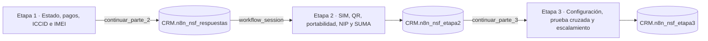

# ETB · Ningún Servicio Funciona

Workflows independientes de **n8n** para guiar, registrar y auditar el diagnóstico de líneas móviles sin servicio. El proceso está separado en tres etapas para facilitar el mantenimiento, las pruebas y la evolución de cada ruta sin afectar las demás.

## Vista general



| Etapa | Alcance | Webhook de producción | Persistencia |
| --- | --- | --- | --- |
| 1 | Estado de línea, pagos, GESTFAC, ICCID, IMEI, bloqueo, documentación y tipo de SIM | `/webhook/etb-form` + puente interno `/webhook/etb-form-handoff` | `CRM.n8n_nsf_respuestas` |
| 2 | eSIM/SIM física/MultiSIM, QR, portabilidad, NIP y recursos en SUMA Móvil | `/webhook/etb-form-parte-2` + puente interno `/webhook/etb-form-parte-2-handoff` | `CRM.n8n_nsf_etapa2` |
| 3 | Configuración del equipo, prueba cruzada de SIM, reinicio, PQR y segundo nivel | `/webhook/etb-form-parte-3` | `CRM.n8n_nsf_etapa3` |

## Archivos principales

- [`Ningun Servicio Funciona - 1.json`](./Ningun%20Servicio%20Funciona%20-%201.json): etapa 1 auditada, responsive y con persistencia MySQL.
- [`Ningun Servicio Funciona - 2.json`](./Ningun%20Servicio%20Funciona%20-%202.json): etapa 2 independiente, continuación del primer flujo y lista para importar en n8n.
- [`Ningun Servicio Funciona - 3.json`](./Ningun%20Servicio%20Funciona%20-%203.json): etapa 3 independiente; abre directamente las decisiones de configuración del equipo.
- [`database/10_etapa2_workbench_setup.sql`](./database/10_etapa2_workbench_setup.sql): crea la tabla, la llave foránea y la vista de la etapa 2.
- [`database/11_etapa2_consultas_control.sql`](./database/11_etapa2_consultas_control.sql): consultas operativas y de seguimiento sin modificar datos.
- [`database/20_etapa3_workbench_setup.sql`](./database/20_etapa3_workbench_setup.sql): crea la tabla, llave foránea y vista de la etapa 3.
- [`database/21_etapa3_consultas_control.sql`](./database/21_etapa3_consultas_control.sql): control de cierres y sesiones pendientes entre las tres etapas.
- [`tools/generar_etapa2.js`](./tools/generar_etapa2.js): fuente mantenible de la etapa 2; reutiliza el frontend responsive de la etapa 1.
- [`tools/validar_etapa2.js`](./tools/validar_etapa2.js): auditoría automática de rutas, nodos, formularios, SQL y contrato entre etapas.
- [`tools/generar_etapa3.js`](./tools/generar_etapa3.js): genera la tercera etapa reutilizando el frontend responsive de la etapa 2.
- [`tools/validar_etapa3.js`](./tools/validar_etapa3.js): audita las decisiones, cierres, responsive, SQL y ausencia de datos personales de ejemplo.
- [`tools/generar_preview_etapa3.js`](./tools/generar_preview_etapa3.js): genera vistas HTML locales de los once formularios de la etapa 3.
- [`tools/generar_preview_etapa2.js`](./tools/generar_preview_etapa2.js): genera vistas HTML locales de los formularios.
- [`tools/conectar_etapas.js`](./tools/conectar_etapas.js): instala la transición de la etapa 1 a la etapa 2 conservando la sesión.
- [`tools/validar_integracion.js`](./tools/validar_integracion.js): comprueba la transición, los webhooks, el contrato SQL y la separación visual.

## Requisitos

- Una instancia de n8n con nodos Webhook, Wait, Code, IF, Respond to Webhook y MySQL.
- Acceso al esquema MySQL `CRM`.
- Las tablas deben instalarse en orden: etapa 1, etapa 2 y etapa 3.
- Una credencial MySQL configurada dentro de n8n. Las contraseñas no deben guardarse en el repositorio, los JSON ni los scripts.

## Instalación

### 1. Preparar MySQL

La etapa 2 depende de la tabla de la etapa 1 mediante `workflow_session`. Con la tabla `CRM.n8n_nsf_respuestas` ya disponible, abre MySQL Workbench y ejecuta:

```sql
SOURCE database/10_etapa2_workbench_setup.sql;
SOURCE database/20_etapa3_workbench_setup.sql;
```

También puedes abrir ambos archivos desde Workbench y ejecutarlos completos. El segundo crea `n8n_nsf_etapa3`, su relación con la etapa 2 y la vista consolidada `vw_n8n_nsf_etapa3`.

### 2. Importar los workflows

1. Importa el JSON de la etapa 1.
2. Importa el JSON de la etapa 2 como un workflow separado.
3. Importa el JSON de la etapa 3 como otro workflow separado.
4. Asigna la credencial `CRM` al nodo `Guardar Respuestas MySQL` de la etapa 1.
5. En la etapa 2, asígnala a `Consultar Contexto Etapa 1 MySQL` y `Guardar Etapa 2 MySQL`.
6. En la etapa 3, asígnala a `Consultar Contexto Etapa 2 MySQL` y `Guardar Etapa 3 MySQL`.
7. Activa una sola versión de cada webhook para evitar rutas duplicadas.

> Las URL de producción solo funcionan cuando el workflow correspondiente está activo. Las ejecuciones de producción se consultan en el historial de n8n y no aparecen en tiempo real sobre el canvas.

### 3. Abrir cada etapa

Etapa 1:

```text
https://<host-n8n>/webhook/etb-form
```

Etapa 2:

```text
https://<host-n8n>/webhook/etb-form-parte-2?workflow_session=<sesion_etapa_1>
```

Etapa 3:

```text
https://<host-n8n>/webhook/etb-form-parte-3?workflow_session=<sesion_etapa_1>
```

Los workflows permanecen separados en n8n, pero están conectados funcionalmente. El último formulario de la etapa 1 publica en `/webhook/etb-form-handoff`; esa entrada valida los datos, guarda la gestión y responde con un Redirect nativo hacia la etapa 2 conservando `workflow_session`. La etapa 2 vuelve a consultar MySQL y no confía en datos sensibles enviados por el navegador.

### 4. Prueba completa de principio a fin

La prueba más estable se realiza con los tres workflows activos y sus URL de producción:

1. Ejecuta los scripts `10_etapa2_workbench_setup.sql` y `20_etapa3_workbench_setup.sql`.
2. Importa `Ningun Servicio Funciona - 1.json`, `Ningun Servicio Funciona - 2.json` y `Ningun Servicio Funciona - 3.json`.
3. Asigna la credencial `CRM` a los cinco nodos MySQL involucrados.
4. Guarda y activa/publica los tres workflows. La etapa 1 registra `/webhook/etb-form` y `/webhook/etb-form-handoff`; la etapa 2 registra `/webhook/etb-form-parte-2` y `/webhook/etb-form-parte-2-handoff`.
5. Abre únicamente `/webhook/etb-form` y completa la etapa 1 hasta seleccionar el tipo de SIM.
6. Al guardar, el navegador debe abrir `/webhook/etb-form-parte-2?workflow_session=...` automáticamente.
7. En SUMA selecciona “Activo y con recursos”; no debe aparecer una pantalla de cierre de etapa 2.
8. El navegador debe abrir directamente `/webhook/etb-form-parte-3?workflow_session=...`.
9. Finaliza la etapa 3 y confirma la misma sesión en las tres tablas.

Para la prueba completa deben estar activos los tres workflows, incluso si iniciaste la primera pantalla desde el editor. Las transiciones usan deliberadamente los webhooks de producción; así no dependen de URL temporales `/webhook-waiting/...` ni de varios listeners de prueba simultáneos.

La transición interna esperada en la etapa 1 es:

```text
Form Tipo SIM
  → Continuar a Etapa 2 (Webhook etb-form-handoff)
  → IF Entrada Handoff Valida
  → Preparar Registro SQL
  → Guardar Respuestas MySQL
  → IF Continuar Etapa 2
  → Redirigir a Etapa 2
```

Los nodos antiguos `Espera Tipo SIM` e `IF Volver Tipo SIM` no deben existir en la versión importada.

`Preparar Registro SQL` construye `handoff_url` a partir de `webhookUrl` o de los encabezados `x-forwarded-*`, sin depender del constructor global `URL` del sandbox. El Redirect nunca debe apuntar a `/webhook/undefined`.

La transición interna esperada después de confirmar SUMA es:

```text
Form Validar SUMA (Activo y con recursos)
  → Continuar directamente a Diagnostico de Equipo (Webhook etb-form-parte-2-handoff)
  → Consultar Contexto Etapa 1 MySQL
  → Preparar Registro Etapa 2 SQL
  → Guardar Etapa 2 MySQL
  → Redirigir a Etapa 3
```

El formulario publica directamente en el webhook puente de producción. Por eso el navegador no queda detenido en `/webhook-waiting/...`. El flujo 2 actualizado debe volver a importarse y publicarse para registrar esta nueva ruta.

## Contrato entre etapas

La etapa 2 permite continuar cuando `workflow_session` existe en la tabla de la etapa 1 y tiene un `tipo_sim` válido. Esto mantiene compatibilidad con gestiones creadas por versiones anteriores. Además, calcula `contrato_canonico` para auditar si la fila conserva los marcadores actuales:

```text
resultado_etapa_1 = continuar_parte_2
next_step = parte_2_tipo_sim
tipo_sim IS NOT NULL
```

La misma `workflow_session` identifica la gestión en ambas tablas. Si la sesión no existe o no tiene tipo de SIM, el webhook responde con una pantalla de contexto inválido y estado HTTP 400.

### Resultados de la etapa 1

- `pago_pendiente`
- `gestfac`
- `gestor_sincronizacion`
- `registro_imei_gestionado`
- `documentacion_bloqueo`
- `continuar_parte_2`

### Resultados de la etapa 2

- `reposicion_qr`
- `espera_nip`
- `gestor_nip_vencido`
- `gestor_sincronizacion_suma`
- `continuar_parte_3`

La etapa 3 solo acepta sesiones con:

```text
resultado_etapa_2 = continuar_parte_3
next_step = parte_3_configuracion_equipo
suma_ok = Si
```

### Resultados de la etapa 3

- `pqr_solucionada_configuracion`
- `pqr_solucionada_falla_dispositivo`
- `pqr_solucionada_reinicio_sim`
- `escalado_segundo_nivel`

## Comportamiento de la etapa 2

- Abre directamente la primera decisión según el tipo de SIM guardado; no muestra una pantalla “Iniciar etapa 2”.
- Las etiquetas visibles usan “Diagnóstico” y no números de etapa, de modo que los tres workflows se perciben como un solo proceso.
- **eSIM:** valida el escaneo y la recuperación del QR antes de revisar portabilidad.
- **SIM física:** comienza directamente con la validación de línea portada.
- **MultiSIM:** solicita identificar si el componente afectado es virtual o físico y usa la ruta correspondiente.
- **NIP recibido:** vuelve a verificar la portación.
- **NIP pendiente:** guarda `espera_nip` y `next_step = revisar_nip`; no deja una ejecución esperando indefinidamente.
- **NIP vencido:** registra `gestor_nip_vencido` después de confirmar el escalamiento.
- **SUMA sin recursos o sin sincronización:** finaliza con `gestor_sincronizacion_suma`.
- **SUMA activo y con recursos:** entrega la respuesta al webhook puente, guarda `continuar_parte_3` y redirige directamente, sin pantalla de cierre ni confirmación de servicio normalizado.

## Comportamiento de la etapa 3

- Abre directamente con el tipo de falla del equipo; no tiene una pantalla de bienvenida redundante.
- Datos/red o ambas fallas pasan por identificación y configuración del equipo.
- Las fallas de llamadas pasan directamente a la disponibilidad de un dispositivo alterno.
- La prueba cruzada determina si la falla corresponde al dispositivo original.
- Sin solución, solicita apagar, retirar la SIM, esperar 20 segundos, reinstalarla y validar.
- Si el reinicio no funciona, registra el escalamiento a segundo nivel.
- La plantilla no contiene nombres, teléfonos ni IMEI de ejemplo.

Los cierres usan un `upsert` por `workflow_session`, por lo que un reintento actualiza la gestión existente en vez de crear duplicados.

## Interfaz responsive

Los formularios de las tres etapas comparten la misma base visual:

- Diseño vertical de una columna por debajo de 900 px.
- Soporte desde 320 px, tabletas, portátiles y monitores Full HD o superiores.
- Escala homogénea en escritorio: la tarjeta permanece entre 720 y 760 px y no crece por la resolución del monitor.
- Modo portátil compacto entre 901 px de ancho y 850 px de alto para aprovechar pantallas de poca altura.
- Modo compacto para orientación horizontal con poca altura.
- Botones Volver y Continuar con altura uniforme y área táctil suficiente.
- Safe areas, unidades `svh`/`dvh` y reducción de movimiento según las preferencias del dispositivo.

## Validación y mantenimiento

Para regenerar y auditar las etapas 2 y 3:

```powershell
node .\tools\aplicar_responsive_homogeneo.js
node .\tools\conectar_etapas.js
node .\tools\generar_etapa2.js
node .\tools\generar_etapa3.js
node .\tools\validar_v11.js
node .\tools\validar_etapa2.js
node .\tools\validar_etapa3.js
node .\tools\validar_integracion.js
node .\tools\generar_preview_responsive.js
node .\tools\generar_preview_etapa2.js
node .\tools\generar_preview_etapa3.js
```

La validación automática recorre eSIM, SIM física, MultiSIM, configuración, prueba cruzada, reinicio y segundo nivel; verifica contratos, botones Volver, persistencia parametrizada y reglas responsive.

Las vistas generadas se guardan en `preview/v11.9-forms/`, `preview/etapa2-v1/` y `preview/etapa3-v1/`; están excluidas de Git. El HTML se repite dentro del JSON porque n8n lo almacena en cada nodo. `aplicar_responsive_homogeneo.js` permite actualizar de forma idempotente los tres workflows sin alterar sus conexiones.

## Consultas operativas

Después de instalar las tablas, ejecuta `database/11_etapa2_consultas_control.sql` y `database/21_etapa3_consultas_control.sql` para consultar:

- Gestiones pendientes de una nueva revisión del NIP.
- Distribución de resultados terminales.
- Consistencia del contrato entre las tres etapas.

## Seguridad

- No guardes usuarios privilegiados, contraseñas ni secretos en Git.
- Configura las credenciales únicamente en el almacén de credenciales de n8n.
- Limita la cuenta de n8n al esquema y operaciones que el flujo necesita.
- Si MySQL rechaza el acceso, valida el usuario configurado, la base seleccionada y que el servidor autorice conexiones desde la IP de salida de n8n.

## Estado del proyecto

- Etapa 1: workflow funcional y auditado, con interfaz responsive y salida preparada para la etapa 2.
- Etapa 2: workflow independiente generado y auditado; requiere ejecutar su script de instalación y seleccionar las credenciales MySQL después de importarlo.
- Etapa 3: workflow independiente generado y auditado; inicia directamente en las decisiones del equipo y conserva la misma `workflow_session`.
